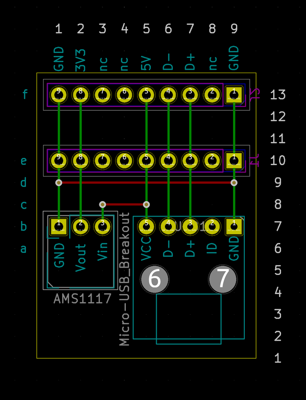

Simple PCB for a breadboard power-supply using a Micro-USB connector and a AMS1117 breakout
===========================================================================================

This is a simple power-supply for a breadboard. There are ready to use power-supplies for
breadboards available, but you usually need a barrel-plug for them and the quality is
not the best. In addition, using a micro-usb connector allows to add data-connections as
well.

The stripboard-design uses a standard micro-usb breakout and an AMS1117 breakout for
the regulator (on the left). The breakout already has the necessary capacitors.

Note that on most breadboards the power and ground row are offset a bit from the normal
pins, so it is not possible to use a stripboard and plug into the power/ground rows directly.

The layout is simple, you only have to provide two wires in addition to the breakouts:

